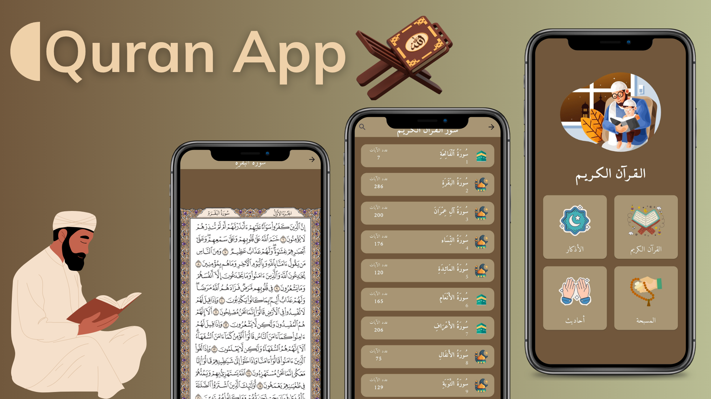
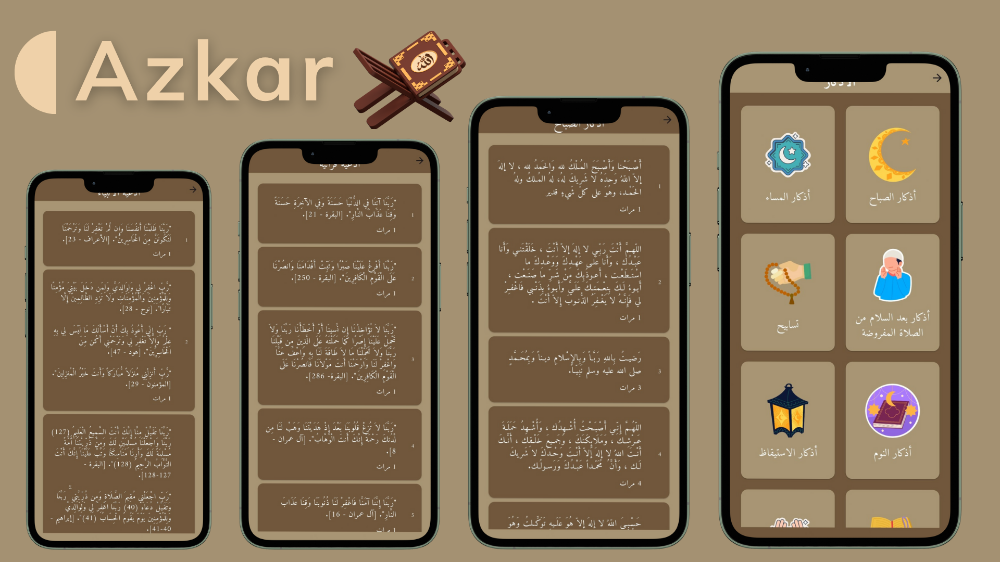
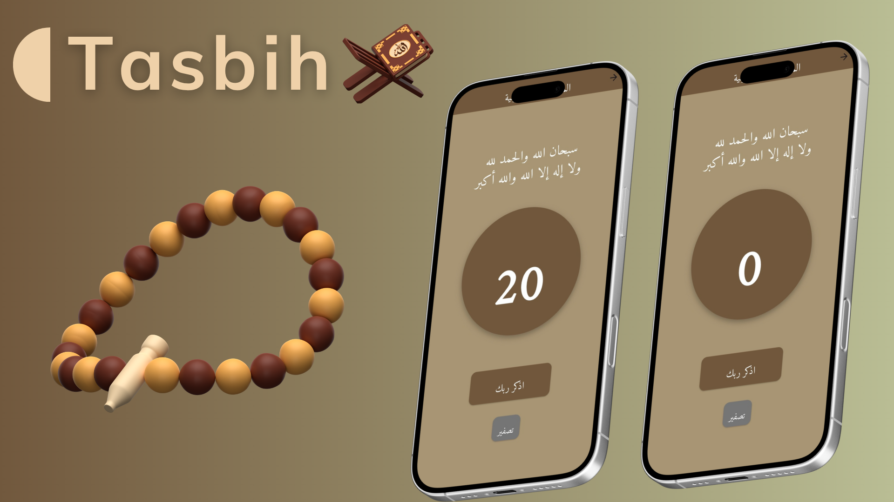

# 📖 Quran App  

A beautiful and modern **Flutter** application designed to provide users with an immersive experience for reading the **Holy Qur’an**, **Azkar (remembrances)**, **Ahadith**, and using a **digital Tasbih**.  
Built with simplicity, elegance, and spirituality in mind. 🌙  

---

## 📌 Project Overview  

**Quran App** is a cross-platform Flutter mobile application that allows users to browse Qur’anic surahs, view Azkar, read Ahadith, and perform Tasbih — all within a simple and intuitive Arabic-first interface.  
It combines **online data fetching** for Qur’an pages with **local assets** for Azkar and Ahadith to ensure both reliability and speed.  

---

## 🛠️ Tech Stack  

| Technology | Description |
|-------------|-------------|
| 🧱 **Flutter** | UI toolkit for building beautiful, natively compiled apps |
| 💡 **Dart** | Programming language used with Flutter |
| 🌐 **HTTP** | For fetching Qur’an data from online APIs |
| 💾 **Local JSON** | For offline Azkar and Hadith data |
| 🎞️ **Lottie** | For smooth animations and UI effects |
| 🌍 **Flutter Localizations** | Enables Arabic (RTL) localization |
| 🖋️ **Amiri Quran Font** | For authentic Arabic Qur’anic text styling |

---

## 🧩 Architecture  

The app follows a **modular and scalable architecture** with a clear separation of concerns:  

- **Models:** Represent data structures for Qur’an, Hadith, and Azkar.  
- **Helpers:** Handle networking, data fetching, and asset management (`link.dart`).  
- **Screens:** Define all UI pages (Home, Quran, Azkar, Tasbih, Hadith).  
- **Widgets:** Contain reusable UI components like custom cards and surah tiles.  
- **Utils:** Store constants, colors, and URLs for easy maintenance.  

This structure ensures **maintainability**, **performance**, and **ease of extension**.  

---

## ✨ Features  

- 🕋 **Qur’an Browser** | Browse all 114 surahs with ayah counts and high-quality page images. 
- 🤲 **Azkar Categories** | Read daily Azkar loaded from local JSON assets. 
- 📜 **Ahadith Section** | Display collections of authentic Ahadith in Arabic. 
- 🔢 **Digital Tasbih** | Simple tasbih counter with reset functionality. 
- 🔍 **Search** | Search within surahs or azkar for quick access. 
- 🌐 **RTL Localization** | Fully localized for Arabic users (RTL support). 
- 💫 **Polished UI** | Custom font, beautiful color palette, and Lottie animations. 

---

## 🚀 How to Run the Project

1. **Clone the repository**  
- git clone https://github.com/a7med2002/quran_app.git

2. **Install dependencies** 
- flutter pub get

3. **Run the app**
- flutter run

## 🖼️ Screenshots

---

## 📦 Download APK  

You can download the latest version of the **Quran App** APK directly from Google Drive:  

👉 [**Download Quran App (APK)**](https://drive.google.com/file/d/1nRRKKxxA1SdBItYZjjiU423kaTeMgBEn/view?usp=sharing)  

---

## 🌐 Social Links

- 👨‍💻 Developer: [ِAhmed Meqdad]
- 📧 Email: [ahmd2002mqdad@gamil.com]
- 💼 LinkedIn: [linkedin.com/in/ahmed-meqdad](https://www.linkedin.com/in/ahmed-meqdad)